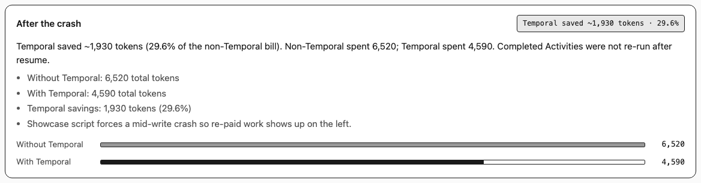

# Durable Research Agent

A side-by-side lab: the **same** multi-step research agent on a typical production stack and on Temporal.

---

## What this project is

### The short version

Imagine you hire a research assistant. You ask a hard question. They search, take notes, write a draft, check their work, and ask you to approve it before it’s final.

That assistant is an **AI agent**: software that takes several steps (not one chat reply) and uses tools along the way (search, a document library, a scoring “judge”).

Now imagine the assistant is a computer program running on a laptop or a server. Halfway through writing the report, someone restarts the machine. What happens to the work?

- Does the half-finished draft vanish?
- Do they redo expensive steps (like calling a paid AI model again)?
- Can they wait overnight for your approval without sitting there refreshing a page every two seconds?

**This project builds that research assistant twice**, with the same brain, on two different “operating systems” for long jobs:

1. **Typical stack** (`without_temporal/`): normal Python, retries, save progress to a small database when you remember to.
2. **Temporal** (`with_temporal/`): a platform designed so long-running work can **survive crashes** by recording what already happened and replaying it.

Then we **crash both mid-run** and compare. The lesson is not “AI is cool.” The lesson is **how you run multi-step AI work when the process can die**.

### What the agent actually does

Same steps on both stacks:

1. Decide if the question needs clarifying  
2. Plan a few search queries  
3. Look up notes in a fixed local library (RAG: retrieve relevant text chunks)  
4. Run web searches in parallel  
5. Write a markdown report  
6. Score the report for faithfulness and relevance (another model as judge)  
7. Optionally rewrite once if the score is low  
8. Wait for a human to approve before finishing  

Shared code means same tools, same library of docs, same judge prompt, same way of counting tokens (roughly: how much the AI models were used, which maps to cost).

### What we are trying to learn

| Question | Why it matters |
|----------|----------------|
| If the process dies mid-step, what is lost? | Real servers restart all the time (deploys, OOM, laptop sleep). |
| Do we pay for the same AI work twice after a crash? | Model calls cost money; waste shows up on the bill. |
| Is “we save checkpoints” enough? | Checkpoints help, but recovery code is hard and often incomplete. |
| How should a human approve a long run? | Polling a database from a live process is different from a durable wait (a **Signal** in Temporal). |
| Where should evaluation live? | If the judge only runs in a notebook after the fact, bad drafts still ship into review. |
| Can a stranger *see* the difference in two minutes? | Code proves it; the dual UI + crash demo make it obvious. |

In one sentence: **we are learning whether multi-step AI agents need the same kind of durable control flow that serious backend systems already use for long jobs.**

### What “durable” means here (without the jargon fog)

**Durable Execution** (Temporal’s idea, in plain words): a run can keep its *progress* even if the worker process crashes. The platform stores an ordered history of what already finished. When a new worker picks up the job, it does not invent progress from thin air. It **replays the history**: completed tool/model steps are not re-done; unfinished ones continue.

Think of a video game with honest save points the engine enforces, not sticky notes you hope you wrote.

Important precision:

- Killing the **Worker** (the process that runs your code) is not the same as killing the **Workflow Execution** (the durable run).
- An **Activity** is one well-defined chunk of work (call the model, search, evaluate). When it finishes, the result is recorded.
- **Event History** is that record. It is not the same as random print logs.
- A **Signal** is an async message into a waiting run (e.g. “approved”). A **Query** is a way to ask “where is this run?” without changing business state.

Canonical terms and links: [Temporal glossary](https://docs.temporal.io/glossary), [`content/concepts/temporal-concepts.md`](content/concepts/temporal-concepts.md).

### How the two sides differ after a crash

| After a crash mid-write | Typical stack (`without_temporal/`) | Temporal (`with_temporal/`) |
|---|---|---|
| In-flight LLM result | Often lost | Incomplete Activity retries per policy; finished result lives in Event History |
| Work already finished | Often re-run (incomplete recovery) | Completed Activities are not re-executed on replay |
| Token bill | Climbs on restart | Tracks completed Activity work, not worker restarts |
| Human approval | Live process polls SQLite | Signal into the Workflow Execution |
| Observability | App logs + DB rows | Event History (Temporal Web UI) |

In the scripted Showcase demo (no API keys, forced mid-write crash), non-Temporal ends around **6,520** tokens and Temporal around **4,590**. Temporal savings: about **1,930** tokens (**~29.6%** of the non-Temporal bill). Live runs use real models; totals vary.



### How to explore the lesson

1. **Showcase UI** (fastest): run the dual crash animation, read the savings panel. No keys.  
2. **Live crash** (real money/tokens): run both agents, kill and resume the non-Temporal path, restart the Temporal worker.  
3. **Write-ups** in [`content/drafts/`](content/drafts/) (crash, HITL, evaluation, lab design).  
4. **Demo video**: [`content/assets/media/2026-07-31-showcase-crash-demo.mp4`](content/assets/media/2026-07-31-showcase-crash-demo.mp4).

```
        ┌──────────────────────────────┐
        │  Shared agent logic          │
        │  LLM · RAG · search · eval   │
        └──────────────┬───────────────┘
                       │
          ┌────────────┴────────────┐
          ▼                         ▼
   without_temporal            with_temporal
   asyncio · tenacity          Workflow Execution
   SQLite checkpoints          Activities · Signals · Queries
```

Architecture diagram: [`content/assets/diagrams/02-shared-brain-two-runtimes.svg`](content/assets/diagrams/02-shared-brain-two-runtimes.svg)

---

## Requirements

- Python 3.10+
- [Temporal CLI](https://docs.temporal.io/cli) (for the Temporal path and Web UI)
- OpenAI API key (live agents; Showcase UI does not need one)

CI runs `ruff` and `pytest` on push and pull requests to `main` (no API keys required).

---

## Quick start

```bash
python -m venv .venv
source .venv/bin/activate          # Windows: .venv\Scripts\activate
pip install -r requirements.txt
cp .env.example .env               # set OPENAI_API_KEY for live runs
```

### Experiment UI (recommended first look)

```bash
python -m ui.app
# http://127.0.0.1:8765
```

| Mode | Purpose |
|------|---------|
| **Showcase** | Scripted dual crash and token comparison. No API keys or Temporal Service. |
| **Live** | Real agents. Crash/resume non-Temporal from the UI. Temporal needs a Worker and `temporal server start-dev`. |

### Non-Temporal CLI

```bash
python -m without_temporal.run "How does durable execution help AI agents?" --auto-approve
```

Human approval (omit `--auto-approve`):

```bash
python -m without_temporal.approve <RUN_ID> approved
```

### Temporal CLI

```bash
# terminal 1
temporal server start-dev

# terminal 2
python -m with_temporal.worker

# terminal 3
python -m with_temporal.run "How does durable execution help AI agents?" --auto-approve --wait
```

Approval Signal:

```bash
python -m with_temporal.signal_approval <WORKFLOW_ID> approved
```

Temporal Web UI: [http://localhost:8233](http://localhost:8233)

---

## Configuration

Copy [`.env.example`](.env.example) to `.env` (gitignored):

| Variable | Default | Purpose |
|----------|---------|---------|
| `OPENAI_API_KEY` | (required for live) | Live LLM and embedding calls |
| `LLM_MODEL` | `gpt-5.6-luna` | Chat/completions model |
| `EMBEDDING_MODEL` | `small` | Resolves to `text-embedding-3-small` |
| `TAVILY_API_KEY` | unset | Optional real web search; otherwise mock search |

---

## Crash recovery

Use the same query; kill both systems at the same point. Walkthrough: [`demos/crash_demo.md`](demos/crash_demo.md).

- **Without Temporal:** resume with `--run-id`. Expect partial recovery and re-paid work.
- **With Temporal:** restart the Worker. The Workflow Execution continues; completed Activities are not re-run when history is replayed.

---

## Repository layout

```text
shared/                 # RAG, evaluation, tools, types, config
without_temporal/       # asyncio + tenacity + SQLite + polling approval
with_temporal/          # Workflow, Activities, Signals, Queries, Worker
ui/                     # Experiment dashboard (FastAPI + static UI)
data/docs/              # Fixed markdown corpus for RAG
demos/                  # Crash recovery procedure
content/                # Teaching assets (see below)
.env.example            # Configuration template
pyproject.toml          # Package metadata and dependencies
requirements.txt        # Pip-friendly install list
```

### Teaching assets (`content/`)

| Path | Contents |
|------|----------|
| `content/concepts/` | Temporal vocabulary, Feature → Benefit → Outcome |
| `content/drafts/` | Long-form posts (01 crash, 02 HITL, 03 eval, 04 lab) |
| `content/tutorials/` | Step-by-step how-tos |
| `content/decks/` | Slide decks and outlines |
| `content/assets/diagrams/` | Infographics (SVG + PNG) |
| `content/assets/media/` | Screenshots and demo video |
| `content/social/` | Short-form distribution cuts |

---

## Design principles

1. **Fair comparison** - the non-Temporal path has retries, checkpoints, and approval; it is not a strawman.
2. **Shared brain** - prompts, tools, corpus, judge, and token accounting are identical.
3. **Stable demos** - fixed local RAG corpus; optional Tavily; Showcase mode without cloud.
4. **Docs-aligned Temporal language** - canonical terms first; plain reuse after.
5. **Evaluation in the loop** - faithfulness and relevance gate refinement before human approval.

---

## License

[MIT](LICENSE)
