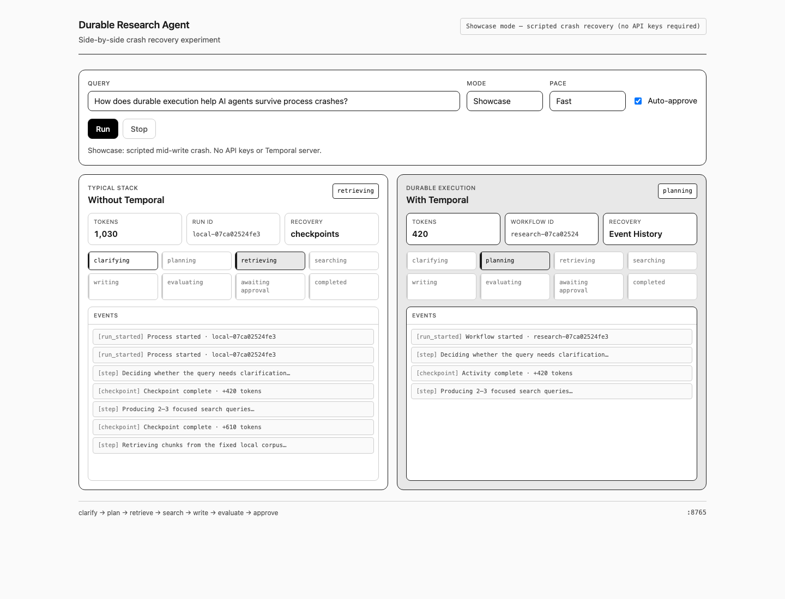

# Your agent is not durable (even with checkpoints)

Retries and SQLite checkpoints do not make an agent durable. They make it slightly less fragile until the process dies mid-call, and then you find out how much of the control flow still lived only in memory.

You want multi-step agents that survive restarts without turning every deploy into a re-run tax. The concrete help is simple: after a crash you should know what was lost, what was re-paid, and what was reused. The feature that makes that teachable is the same research agent implemented twice, with the same tools and prompts, on two control planes.

## The experiment

I built one multi-step research agent and ran it on two stacks:

| | Typical stack | Temporal |
|---|---|---|
| Control flow | asyncio | Workflow Execution |
| Retries | tenacity | Activity Retry Policy |
| State after crash | SQLite checkpoints you maintain | Event History |
| Human approval | poll a DB row | Signal |

Shared pieces: RAG corpus, search tools, evaluation prompt, token accounting. Only orchestration changes. Terms follow the [Temporal glossary](https://docs.temporal.io/glossary).

The agent does ordinary work. It clarifies the query if needed, plans a few searches, retrieves from a fixed local corpus, runs web search in parallel, writes a markdown report, scores faithfulness and relevance with an LLM judge, optionally refines once, then waits for human approval. If durability is messy here, it will be messier in a larger system.



## The crash

Use the same query on both stacks. Kill both at the same point, ideally while the report is being written, after plan, retrieve, and search have already spent tokens.

On the typical stack you reload the last checkpoint. The in-flight LLM result is gone. Tokens already billed to the provider may not match what your state file claims. Resume code has to reconstruct nested objects, decide which stages to skip, and hope you checkpointed the right fields. The recovery path you tested works; the edge you did not test is where production fails.

On Temporal a Worker can die without ending the Workflow Execution. That is Durable Execution: the run keeps its state through failures. Events land in Event History; on resume the history is replayed. Completed Activity results are reused, not recomputed. Incomplete work follows its Retry Policy.

The non-Temporal side is not a weak opponent. It has retries, checkpoints after major stages, and an approval gate. It still loses on resume correctness and on how much of the story you can inspect after a kill.

## Tokens as a reliability metric

After crash and restart, compare cumulative tokens for the same query.

In the scripted Showcase demo (no API keys, forced mid-write crash), the non-Temporal path ends around **6,520** tokens and Temporal around **4,590**. Temporal saved about **1,930** tokens: **29.6%** of the non-Temporal bill. That is not marketing math; it is the script making re-paid work visible.


The typical stack often pays again for work that looked saved: a partial write that never checkpointed, a re-plan because recovery restored too little, a full rewrite of the report. Temporal keeps completed Activities completed, so the bill tracks progress more than restart count.

If a crash doubles spend, the control plane is incomplete. That is a sharper signal than “we should add more logging.”

## Why checkpoints are not enough

Checkpointing is necessary and still application code. You decide when to write state, what to serialize, how to skip stages on resume, what happens to in-flight calls, and which process must stay alive while a human thinks. Each of those choices is a place agents shed correctness under load.

Durable Execution moves those problems into the platform: a Temporal Service plus workers. LLM and tool calls become Activities; their results land in history. You still design the agent. You stop re-implementing a half-finished workflow engine beside it.


## Seeing it

```bash
git clone https://github.com/ryanlingo/durable-research-agent.git
cd durable-research-agent
python -m venv .venv && source .venv/bin/activate
pip install -r requirements.txt
python -m ui.app
# http://127.0.0.1:8765 → Showcase → Run
```

Showcase mode walks both paths through a mid-write crash without API keys. Live mode drives real agents when you want production-shaped traces. CLI crash walkthrough: `demos/crash_demo.md`. After you restart a Temporal worker, Event History is at http://localhost:8233.

Retries survive bad HTTP responses. They do not survive process death. Checkpoints help only as far as the recovery code you actually maintain. The token total after a forced crash is where that difference shows up without slogans.
