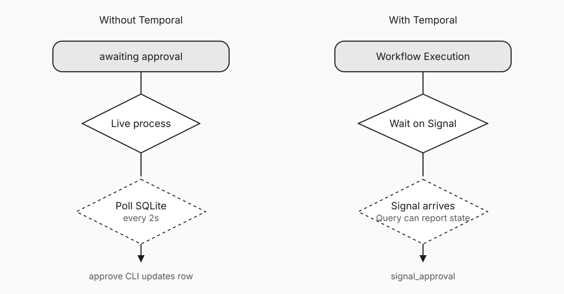

# Human-in-the-loop should not require a live process

If approval requires a Python process to stay alive and poll a database, you do not have durable human-in-the-loop. You have a long-lived poller that sometimes calls a model.

You want people to review agent output on human time without keeping workers warm for hours. The concrete help is a wait that survives restarts and deploys. The feature is a Signal into a Workflow Execution versus a loop that reads SQLite every two seconds.

This is the second post in a lab that runs the same research agent twice: typical stack vs Temporal. Post 1 covered crash recovery and re-paid tokens. Here the subject is the approval gate.

## How the two stacks wait

After evaluation, the non-Temporal agent writes `approval_status = pending`, prints a command for another terminal, and loops: read the row, sleep two seconds, repeat. That is fine on a laptop. In production it means a process stays scheduled for the whole wait, deploys and scale-to-zero fight you, and a crash during the wait sends you back into recovery code. The “workflow” is a process that has not exited yet.

The Temporal Workflow Execution reaches approval and waits for a Signal: an asynchronous request into that run. No application poll loop, and the same Worker does not need to stay alive. When a human or another service signals approval, the run continues from Event History. A Query can report that it is waiting without changing business state.



## Why this shows up in agents

LLM systems stretch time with clarification, second looks at tool output, compliance review, and “ship the draft tomorrow.” Each is a wait. Polling processes charge you for human delay. Durable waits do not.

The SQLite approval table is a reasonable first cut. Many teams ship it. The failure mode is not that polling is immoral. It is that multi-day review, restarts, and inspectable history become your problem again, in application code, every time.

| Concern | Polling process | Signal |
|---|---|---|
| Compute while waiting | Process stays up and wakes | Workflow waits without a poll loop |
| Worker restart mid-wait | Rehydrate and re-enter the loop | Built into Durable Execution |
| What you can inspect later | Whatever you logged or stored | Signal shows up in Event History |
| Multi-day approval | Awkward | Natural |

## Demo

```bash
# Non-Temporal: leave process running, omit --auto-approve
python -m without_temporal.run "What is durable execution for AI agents?"
python -m without_temporal.approve <RUN_ID> approved

# Temporal: Worker can stop while the run waits
python -m with_temporal.run "What is durable execution for AI agents?"
python -m with_temporal.signal_approval <WORKFLOW_ID> approved
```

History in the Temporal Web UI should show completed Activities, a wait, a Signal, then completion. Lab: https://github.com/ryanlingo/durable-research-agent

If a person must touch the run, design the wait the way you design the tool call: durable, observable, and restart-safe.
