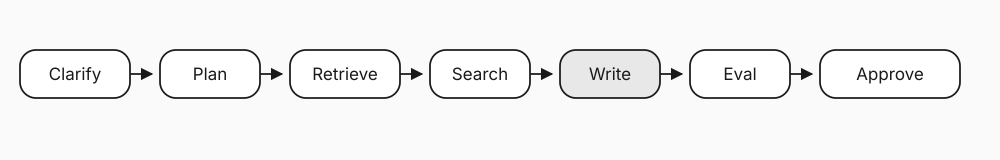

# Building a side-by-side lab for durable agents

A Temporal-only demo lets skeptics assume the other side was weak on purpose. An asyncio-only demo never shows what Durable Execution changes. The lab rule was one agent brain and two nervous systems.

You want a proof you can open in a browser or clone in five minutes, not a slide that asks for trust. The concrete help is a fair crash comparison with shared tools and token totals. The feature is this repository: shared agent logic, two orchestrations, and a dual-column experiment UI.

Posts 1–3 covered crash recovery, human approval, and evaluation in the loop. This post is the lab itself: how it is laid out and what “fair” meant.

## Layout

```
shared/                 # RAG, tools, eval, types, config
without_temporal/       # asyncio, tenacity, SQLite, polling approval
with_temporal/          # Workflow, Activities, Signals, Queries, Worker
ui/                     # Dual-column experiment dashboard
data/docs/              # Fixed corpus for RAG
demos/                  # Crash procedure
content/                # Posts, diagrams, social
tests/                  # Showcase + Workflow tests (mocked Activities)
```

Shared code is an experimental control. When tokens diverge after a crash, the cause is not different prompts.


## What fair required

Both paths run the same pipeline: clarify, plan, retrieve, search, write, evaluate, approve. Both parallelize search (`asyncio.gather` vs concurrent Activities). Both retry with a cap. Both have a human gate. Both accumulate prompt and completion tokens end to end.

The non-Temporal implementation still checkpoints after major pipeline stages, resumes by `run_id`, and exposes an approval CLI. That is a serious default production cut, not a single `try/except` around one call.



## The UI is part of the measurement

CLI traces convince people who already agree. A dual pipeline that crashes on purpose works in a room.

Showcase mode needs no API keys, scripts a mid-write crash, and shows Temporal savings as tokens and percent. Live mode drives real model calls, crash and resume on the non-Temporal side, and Temporal status through Workflow Queries. Start it with `python -m ui.app` and open http://127.0.0.1:8765.


Everything above the split in the architecture diagram is identical. Everything below it is the product decision you make when you “just ship an agent.”

## Fixed corpus

External vector databases and noisy live web results make demos flake. The lab uses a small markdown corpus under `data/docs/` so retrieval stays stable and the story stays on orchestration. Web search can use Tavily when a key is present; otherwise it returns a deterministic mock.

## Reusing the pattern

You do not need this research agent. You need one real multi-step path you already run, a second implementation that only changes durability and control flow, a crash point everyone can see, and metrics non-experts understand (tokens, work re-run, time to recover). If the second implementation feels like too much work, that is evidence about the recovery surface area already hidden in the first.

Side-by-side keeps the argument honest. It ties Durable Execution to failures AI engineers already hit (Worker restarts, wasted spend, approval waits) instead of platform claims that never touch a kill -9.

Lab: https://github.com/ryanlingo/durable-research-agent
