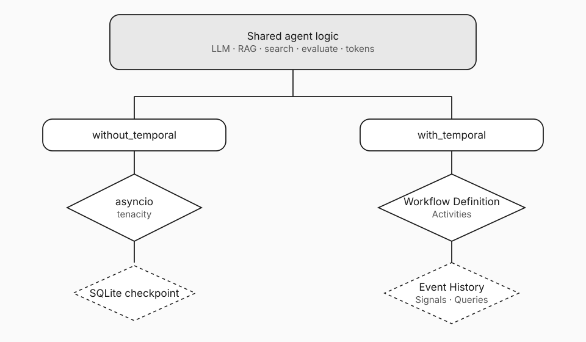

# Run the Showcase UI (no API keys)

| Layer | |
|-------|--|
| **Feature** | Scripted dual-column crash demo in the experiment UI |
| **Benefit** | See re-paid work and Temporal savings without OpenAI or a Temporal Service |
| **Outcome** | Decide in minutes whether durable control flow is worth a deeper look |

## Setup

```bash
git clone https://github.com/ryanlingo/durable-research-agent.git
cd durable-research-agent
python -m venv .venv
source .venv/bin/activate   # Windows: .venv\Scripts\activate
pip install -r requirements.txt
```

No `.env` required for Showcase.

## Start the UI

```bash
python -m ui.app
# or: make ui
```

Open [http://127.0.0.1:8765](http://127.0.0.1:8765).

## Run the default crash (mid-write)

1. Leave **Mode** on **Showcase**.  
2. Leave **Crash at** on **writing** (default).  
3. Pace: **Fast** if you want a quick pass; **Talk** or **Slow** for a room.  
4. Keep **Auto-approve** checked.  
5. Click **Run**.

Watch both columns move through clarify → plan → retrieve → search → writing. At writing, both “crash.”

| Side | What you should notice |
|------|-------------------------|
| **Without Temporal** | Partial recovery from a checkpoint; re-ran steps (often planning edge case + writing); higher final tokens |
| **With Temporal** | Worker-style resume; completed stages not re-paid; lower final tokens |

When both finish, the **After the crash** panel shows Temporal savings (tokens and percent) and **What re-ran (without Temporal)**.

Scripted Showcase numbers for mid-write are about **6,520** without vs **4,590** with Temporal (~**29.6%** savings). Exact scripted totals stay stable; Live mode varies with real models.


## Try another crash point

1. Stop if a run is active.  
2. Set **Crash at** to **searching** or **evaluating**.  
3. Run again.

Mid-search highlights the gather-vs-concurrent-Activities story (post 05). Mid-eval is the judge-as-control-flow story (post 03). Gap catalog: [`../concepts/recovery-gaps.md`](../concepts/recovery-gaps.md).

## Architecture in one picture



## Next

- CLI crash without Temporal: [`02-crash-without-temporal.md`](02-crash-without-temporal.md)  
- Worker kill with Temporal: [`03-crash-with-temporal.md`](03-crash-with-temporal.md)  
- Short dual procedure: [`../../demos/crash_demo.md`](../../demos/crash_demo.md)  
- Demo video: [`../assets/media/2026-07-31-showcase-crash-demo.mp4`](../assets/media/2026-07-31-showcase-crash-demo.mp4)  
