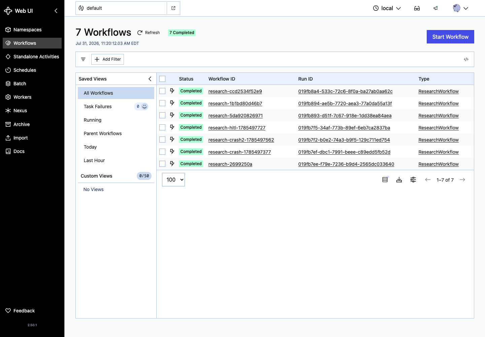

# Kill the Temporal Worker; keep the Workflow Execution

| Layer | |
|-------|--|
| **Feature** | Start a research **Workflow Execution**, kill the **Worker Process**, restart the Worker |
| **Benefit** | See completed **Activities** skip re-execution on **Event History** replay |
| **Outcome** | Separate “my process died” from “my agent run is dead” |

Terms follow [`../concepts/temporal-concepts.md`](../concepts/temporal-concepts.md) and the [Temporal glossary](https://docs.temporal.io/glossary).

## Setup

Install the [Temporal CLI](https://docs.temporal.io/cli) if needed. From the repo:

```bash
source .venv/bin/activate
cp -n .env.example .env   # OPENAI_API_KEY set
pip install -r requirements.txt
```

## Three terminals

### Terminal 1: Temporal Service (dev)

```bash
temporal server start-dev
```

Web UI: [http://localhost:8233](http://localhost:8233).

### Terminal 2: Worker Process

```bash
python -m with_temporal.worker
# or: make worker
```

### Terminal 3: start the Workflow Execution

```bash
python -m with_temporal.run \
  "How does durable execution help AI agents survive process crashes?" \
  --auto-approve \
  --wait
```

Note the printed workflow id (for example `research-…`).

## Kill the Worker mid-run

When terminal 3 or the Web UI shows progress past planning or searching (or while writing):

```bash
pkill -f "with_temporal.worker"
```

The **Workflow Execution** is not the Worker. Killing the Worker stops progress until another Worker polls the **Task Queue**. It does not delete Event History.

## Restart the Worker

```bash
python -m with_temporal.worker
```

With `--wait` still attached in terminal 3, the run should continue and complete. Completed Activities are not re-done when history is replayed; incomplete work follows the Activity Retry Policy.

## Event History

In the Web UI, open the Workflow Execution and inspect history. You should see Activity lifecycle events, not only application logs.



## Optional: approval Signal (no auto-approve)

Start without `--auto-approve` (and without `--wait` if you prefer). When status is awaiting approval:

```bash
python -m with_temporal.signal_approval <WORKFLOW_ID> approved
```

That is a **Signal** into the Workflow Execution. No application poll loop is required (post 02).

## Live UI

With server + worker up, use the full Live walkthrough: [`04-live-mode.md`](04-live-mode.md).

```bash
python -m ui.app
```

Mode **Live**, run both sides. Temporal events should show Activity start/complete, waits, and Execution status. Crash/Resume buttons act on the non-Temporal column only.

## Compare to the other path

Same query, kill process, resume by `run_id`: [`02-crash-without-temporal.md`](02-crash-without-temporal.md). Dual script: [`../../demos/crash_demo.md`](../../demos/crash_demo.md).

Lab: https://github.com/ryanlingo/durable-research-agent
